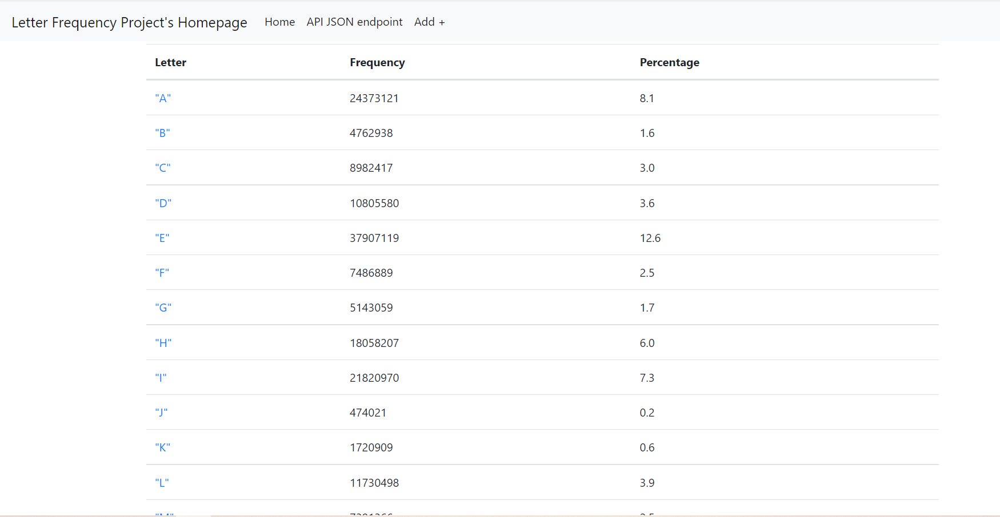

# Project Description
This Project is about letters frequency using Python, flask, MySQL and Docker
# Postman Screenshot
### GET

### POST

### PUT

### DELETE

### Final records

# SQL data screenshot

# Screenshots of project
### Homepage
  
### Viewpage

### Editpage

### Newpage

### API JSON Endpoint
  
